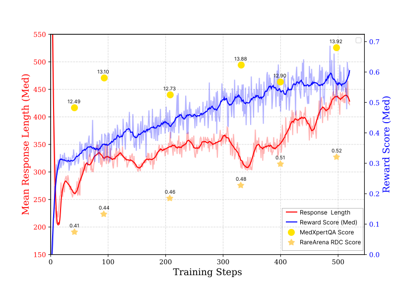

# 📖 ReMEDY: Reasoning-Medical Enhancement Deepened bY Reinforcement Learning

## 🎯 Overview
Inspired by [*Deepseek-R1-Zero*](https://arxiv.org/abs/2501.12948), this study explores the potential of rule-based reinforcement learning (RL) to enhance reasoning capabilities in medical problem-solving.

Our experiments revealed that relying solely on medical question-answering (QA) data resulted in limited token length increases during training. By integrating reasoning-based data, we observed improvements in test-time scaling for medical tasks in response length. Additionally, the model's response pattern shifted from knowledge recall to reasoning-based thinking.

Moreover, testing results indicated that training with both medical and reasoning-based datasets led to significant improvements across both in-domain and out-of-domain medical benchmarks, surpassing the performance achieved with medical data alone. We demonstrate that rule-based reward reinforcement learning holds substantial potential beyond mathematics and coding tasks.

By sharing experimental insights and open-sourcing relevant code and data, we aim to inspire future research on large-scale model reinforcement learning in diverse domains.

<div align="center">

</div>

## 📝 Training Details

### Dataset
* **Medical**: We collected the training dataset from [*MedQA*](https://arxiv.org/abs/2009.13081) and [*MedMCQA*](https://arxiv.org/abs/2203.14371). Multiple-choice questions were reformatted into open-ended formats, excluding those unsuitable for conversion or lacking unique answers (e.g., questions requiring identification of incorrect options). We then employed perplexity (PPL) and pass@n metrics to assess question difficulty. Questions were filtered based on two criteria: 
  1. Those too easily solvable (achieving full correctness within few rollouts).
  2. Overly challenging (consistently scoring ≤2/5 across 16 rollouts, indicating ambiguity or multiple plausible answers).

* **Reasoning**: Randomly sampled from the open-source math dataset available in [*Open-Reasoner-Zero*](https://github.com/Open-Reasoner-Zero/Open-Reasoner-Zero).

* **LogicRL**: Randomly sampled from [*Knights and Knaves (K&K) puzzles dataset*](https://arxiv.org/abs/2410.23123).

The final medical dataset contains 4,146 questions from MedQA (mostly english), 1,486 questions from MedMCQA, 6,348 questions from Open-Reasoner-Zero and 6,348 questions from K&K puzzles dataset.

### Reward Model
Unlike math problems, medical problems often lack a strictly defined ground truth, as models may use synonyms or paraphrases of the correct answer. Consequently, exact equality is not an effective rule-based verification method for medical tasks. To address this, we employ an additional LLM to evaluate and score the answers. This model compares the generated answer with the provided ground truth, assessing whether the answer conveys the same meaning as the ground truth. Answers are scored as 2 for completely correct, 1 for partially correct (i.e., provide multiple answers, with one corresponding to the correct answer), and 0 for incorrect responses.

### Settings
We use [*Qwen2.5-7B*](https://huggingface.co/Qwen/Qwen2.5-7B) as our baseline, using Proximal Policy Optimization (PPO) but remove the kl penalty. The code is built on the [*verl*](https://github.com/volcengine/verl) framework.

It should be noted that, with the same number of training steps, the model with reasoning-based data was trained on only 45% of the medical data compared to the model without reasoning-based data since we maintained the same batch size throughout each steps.

## 🗞️ Our Findings

### ⚡ Test-time scaling when integrating with reasoning-base data
<table>
  <tr>
    <td align="center">
      
    </td>
  </tr>
</table>

We observed that without reasoning-based data, the response length in medical tasks remained short, with no indication of scaling up. Entropy continued to decrease, and n-gram overlap sharply increased, indicating greater similarity among rollouts and resulting in low-efficiency learning.

However, when reasoning-based data were integrated, the response length became longer and showed a clear upward trend, and the reward score consistently improved. Additionally, entropy maintained a slow upward trend, which was conducive to enhancing model performance.

We also noticed that logicRL dataset, i.e. the K&K puzzles, exhibited similar functionality to reasoning-based datasets. It also resulted in a noticeable increase in response length and a gradual upward trend in entropy in medical tasks. However, when comparing under the same consumed medical samples, reasoning-based data enhanced the reward score relative to the baseline, whereas the LogicRL dataset slightly reduced it. This suggestes that the quality and diversity of reasoning-based data also influence the model's ability to generalize across other domains.

### ⚡ Generalized ability
We evaluted the model performance both in-domain(MedQA, MedMCQA) and out-of-domain([*MedXpertQA*](https://arxiv.org/abs/2501.18362), [*RareArena*](https://huggingface.co/datasets/THUMedInfo/RareArena), ClinicalBench).

- Although we train the model using questions in an open-ended format, we evaluate its performance on multi-choice QA datasets such as MedQA, MedMCQA, and MedXpertQA in the standard multi-choice manner, where the model selects the correct option from provided choices.
- RareArena dataset is a comprehensive rare disease diagnostic dataset. In this dataset, the model is required to generate five disease names based on patient conditions, and we evaluate the inclusion of the ground truth in the generated list.
- ClinicalBench is an in-house Chinese benchmark featuring open-ended questions, encompassing both diagnostic and treatment tasks.

<table>
  <tr>
    <td align="center">
      
    </td>
  </tr>
</table>

Despite the reduced medical data volume, the model with reasoning-based data outperformed the model without such data in the aforementioned benchmarks. 

However, we did not observe significant improvements in the Chinese benchmarks (bottom left and bottom right). We hypothesize that this is primarily due to the reasoning-based training data being exclusively in English, which hinders the model's ability to generalize these capabilities to Chinese. This limitation might be mitigated in larger language models.

Additionally, we observed a significant decline in performance on the MedQA-US test set when the model was trained exclusively on medical datasets. This suggests an overfitting issue with the open-ended question format, which hinders the performance of the standard multi-choice manner.

## 📖 Examples
During training, we observed a shift in the model's response pattern from simple knowledge recall to reasoning-based analysis. This process involves enumerating multiple possibilities, eliminating options based on specific patient conditions, transitioning between ideas, selecting the optimal solution, and self-verification.

### Diagnosis(In domain)

<details open>

👀 **Question:** A 48-year-old woman is brought to her primary care physician by her sister who is concerned about a deterioration in the patient’s general status. The patient was diagnosed with HIV 7 years ago. She says that her last T cell count was 'good enough', so she has been skipping every other dose of her antiretroviral medications and trimethoprim-sulfamethoxazole. Her sister has had to drive her home from work several times this month because she has become disoriented and confused about her surroundings. Motor strength is 4/5 on the right and 3/5 on the left. She is able to walk unassisted, but her gait appears mildly uncoordinated. There is diplopia when the right eye is covered. Her CD4 count is 75 cells/µL. MRI shows numerous asymmetric, hyperintense, non-enhancing lesions bilaterally without mass effect. Brain biopsy shows demyelination and atypical astrocytes. What is the most likely cause of this patient's current condition?

📚 **Ground Truth:** John Cunningham virus (JC virus)

❌ **Model Response at epoch 0:**

&lt;think&gt;
Based on the patient's history of HIV infection with a declining CD4 count, the development of symptoms such as confusion, disorientation, uncoordinated gait, and diplopia, as well as imaging findings of hyperintense, non-enhancing lesions on MRI, the most likely cause of this patient's current condition is HIV-associated neurocognitive disorders (HAND). The patient's decline in CD4 count might indicate an inadequate response to antiretroviral therapy, which is crucial for preventing neurocognitive complications. The presence of atypical astrocytes further suggests a pathological process ongoing in the brain, consistent with HAND.

The history of skipping medication also supports this diagnosis, as non-adherence to antiretroviral therapy can lead to a rise in HIV viral load, exacerbate neurocognitive impairment (NCD), and potentially facilitate the development of more severe neurological manifestations. Given the initial diagnosis of HIV 7 years ago and the current findings, it appears the patient has progressed to AIDS with concomitant neurological complications.&lt;/think&gt;

The most likely cause of this patient's current condition is HIV-associated neurocognitive disorders (HAND).


✅ **Model Response at epoch 3:**

&lt;think&gt;
<span style="background-color: rgba(65, 247, 4, 0.5);">Considering</span> the patient's history of HIV infection and the MRI findings of multiple symmetric, hyperintense, non-enhancing lesions without enhancement, along with brain biopsy results indicating demyelination and atypical astrocytes, it is important to identify the potential causes related to HIV and HIV-associated neurological disorders. <span style="background-color: rgba(65, 247, 4, 0.5);">Given that</span> the patient has been non-adherent to her antiretroviral therapy, her recent drop in CD4 count (from presumably a higher level, as stated by her sister) and clinical presentation such as cognitive impairment, gait uncoordination, and diplopia, suggests a possible development of HIV-associated opportunistic infection or inflammatory condition leading to neurological manifestations.

The lack of contrast enhancement on the MRI <span style="background-color: rgba(65, 247, 4, 0.5);">rules out</span> typical features of common neoplastic lesions in the brain, while the pattern observed <span style="background-color: rgba(65, 247, 4, 0.5);">is more indicative of</span> an inflammatory process consistent with central nervous system manifestations of progressive multifocal leukoencephalopathy (PML) or less commonly, toxoplasmosis or other infections/lesions seen in advanced HIV disease, such as cytomegalovirus (CMV), varicella-zoster virus (VZV), or several others. <span style="background-color: rgba(65, 247, 4, 0.5);">However</span>, since the specific cells seen through biopsy are described as atypical astrocytes and given the pattern of these lesions, <span style="background-color: rgba(65, 247, 4, 0.5);">one of the most probable scenarios</span> would be primary central nervous system lymphoma, progressive multifocal leukoencephalopathy, <span style="background-color: rgba(65, 247, 4, 0.5);">or possibly</span> complications from the immune reconstitution inflammatory syndrome in the setting of severe immune suppression.

<span style="background-color: rgba(65, 247, 4, 0.5);">However</span>, given the context and typical presentations related to HIV-associated neurological complications, <span style="background-color: rgba(65, 247, 4, 0.5);">especially considering</span> the patient's history of skipping doses of antiretroviral and preventive therapies against opportunistic infections like PCP or tuberculosis, and now presenting with localized neuronal and glial changes indicating a significant level of immune depression, <span style="background-color: rgba(65, 247, 4, 0.5);">the most likely cause</span> for the patient's current condition could be progressive multifocal leukoencephalopathy (PML), which is caused by the JC virus that typically reactivates in patients with severe immunodeficiency, such as those with very low CD4 counts despite treatment.

This condition typically manifests with demyelinating lesions seen on MRI, clinical signs of impaired cognition and motor function, and <span style="background-color: rgba(65, 247, 4, 0.5);">is consistent with</span> the biopsied findings of demyelination and atypical astrocytes in the context of severe immune suppression.&lt;/think&gt;

The most likely cause of this patient's current condition is **progressive multifocal leukoencephalopathy (PML)**, given the clinical presentation, MRI findings of demyelinating lesions, and the patient's severe immune suppression as indicated by the low CD4 count and non-adherence to antiretroviral therapy, leading to a reactivation of the JC virus, which is characteristic of PML in patients with advanced HIV disease.

</details>

### Diagnosis(Out of domain)

<details open>

👀 **Question:** The patient is a 17-year-old male who presented to the Neurology outpatient service with complaints of recurrent falls and brief alterations in consciousness. These symptoms began two years prior, following an episode witnessed by his university roommate where he experienced a brief loss of consciousness lasting less than a minute. The episodes were characterized by head drops, occasional squat drops, and drop attacks, but the patient denied losing consciousness, describing a sensation of weakness instead. He reported a feeling of heaviness or tingling in his head before the falls. There were no associated symptoms of vision loss, tonic-clonic movements, or bladder/bowel incontinence. There was no personal or family history of epilepsy or cardiac conditions. He had been previously treated for juvenile absence epilepsy with anti-seizure medications, but his symptoms persisted. Further details revealed that the episodes were related to emotional situations such as laughter, excitement, and pleasant surprises. The patient also reported excessive daytime sleepiness despite adequate night-time sleep, often dozing off during monotonous activities but staying awake when engaged in enjoyable activities. He experienced sleep paralysis and weight gain starting three years prior but had no other sleep-related symptoms such as snoring, intermittent awakenings, hallucinations, or behaviors suggestive of REM sleep behavioral disorder. There were no symptoms of sustained weakness, double vision, imbalance, facial sensory deficits, dysphagia, voice changes, skin lesions, cough, fever, breathlessness, or nausea. There was no history of depression, hypothyroidism, or substance use disorder, and no family history of sleep disorders. The patient had a history of degenerative myopia, anisometropia, and left exotropia managed with corrective lenses since age five, as well as a mild speech impediment and limb length discrepancy. Physical examination and mental status examination were unremarkable, though the patient expressed some distress due to his symptoms. Routine investigations, including complete blood count, random blood glucose, malaria parasite screen, and serum electrolytes, were normal. An electroencephalogram (EEG) showed no abnormalities, and a magnetic resonance imaging (MRI) scan also revealed no abnormalities. The patient was admitted for an adapted multiple sleep latency test and/or event monitoring. He was instructed to ensure at least six hours of sleep per night for three days prior to the test. Using a routine EEG machine in a controlled environment, sleep latency was defined as the time from lights out to sleep onset, with sleep onset marked by specific EEG changes. After four sleep trials, a mean sleep latency of 6 minutes 39 seconds was recorded, with individual latencies of 2 minutes 2 seconds, 1 minute 45 seconds, 20 minutes, and 2 minutes 49 seconds. The result came out weeks later as <30 pg/mL.

Enumerate top 5 most likely rare disease for the patient.

📚 **Ground Truth:** Narcolepsy with cataplexy

❌ **Model Response at epoch 0:**

&lt;think&gt;
Given the patient's symptoms of recurrent falls, brief alterations in consciousness, emotional triggers, excessive daytime sleepiness, and sleep paralysis, we need to consider rare diseases that could present with these combined features. Here are the top five most likely rare diseases:

1. **Familial Hypnotic Sudden Death Syndrome (FHSDS)**: This is a rare genetic disorder characterized by recurrent episodes of sudden loss of consciousness and respiratory arrest, often triggered by emotional stimuli. However, the lack of cardiac abnormalities in the patient's MRI and EEG findings makes this less likely.

2. **Paroxysmal Kinesigenic Dyskinesia (PKD)**: This is a rare movement disorder that can cause sudden, involuntary movements triggered by voluntary movement or emotional stress. While it primarily affects motor function, it could potentially cause falls and altered consciousness.

3. **Sleep Paralysis with Cataplexy (narcolepsy type 1)**: This condition involves episodes of sleep paralysis and cataplexy, which is a sudden loss of muscle tone triggered by emotions. The patient's history of sleep paralysis aligns with this diagnosis, but the absence of other narcolepsy symptoms like excessive daytime sleepiness (EDS) and cataplexy makes it less likely.

4. **Idiopathic Hypersomnia**: This is a rare disorder characterized by excessive daytime sleepiness and prolonged sleep, which can lead to brief episodes of altered consciousness. The patient's history of excessive daytime sleepiness and the presence of sleep paralysis are consistent with this diagnosis.

5. **Fragile X Syndrome**: Although more commonly associated with intellectual disability and autism, Fragile X Syndrome can also present with sleep disturbances, including excessive daytime sleepiness and sleep paralysis. However, the patient's normal cognitive function and lack of other typical Fragile X symptoms make this less likely.

Considering the patient's symptoms and the results of the adapted multiple sleep latency test, the most likely rare disease for the patient is **Idiopathic Hypersomnia**. The mean sleep latency of 6 minutes 39 seconds, which is within the normal range, suggests that the patient's excessive daytime sleepiness is not due to a sleep disorder like narcolepsy. The presence of sleep paralysis and the patient's distress due to his symptoms further support this diagnosis.&lt;/think&gt;

The top 5 most likely rare diseases for the patient are:
1. Paroxysmal Kinesigenic Dyskinesia (PKD)
2. Idiopathic Hypersomnia
3. Sleep Paralysis with Cataplexy (narcolepsy type 1)
4. Fragile X Syndrome
5. Familial Hypnotic Sudden Death Syndrome (FHSDS)

✅ **Model Response at epoch 4:**

&lt;think&gt;
Given the patient's clinical presentation and the test results, <span style="background-color: rgba(65, 247, 4, 0.5);">we need to consider a range of potential conditions.</span> The patient has recurrent episodes of brief loss of consciousness or near loss of consciousness, typically triggered by emotional stimuli like laughter or excitement. The absence of typical features of epilepsy or other neurological conditions makes these episodes intriguing. Additionally, the patient reports excessive daytime sleepiness, sleep paralysis, and weight gain, <span style="background-color: rgba(65, 247, 4, 0.5);">which could point towards a condition </span>like narcolepsy or a sleep disorder involving rapid eye movement (REM) sleep.

The key features include:
1. Recurrent episodes of brief loss of consciousness or near loss of consciousness triggered by emotional stimuli.
2. Excessive daytime sleepiness.
3. Sleep paralysis and weight gain.
4. Normal EEG and MRI results.
5. Short mean sleep latency in a multiple sleep latency test (MSLT).

Given these features, particularly the short mean sleep latency and the lack of typical seizure activity on EEG, a condition that often presents with these features is narcolepsy, especially with cataplexy, which is typically triggered by strong emotions. <span style="background-color: rgba(65, 247, 4, 0.5);">However</span>, the absence of cataplexy in this case is not typical for classic narcolepsy. <span style="background-color: rgba(65, 247, 4, 0.5);">Another possibility</span> is a condition known as paroxysmal kinesigenic dyskinesia, but this usually presents with brief, sudden, and repetitive movements triggered by voluntary movements, not typically with loss of consciousness or sleep-related features.

<span style="background-color: rgba(65, 247, 4, 0.5);">A more likely candidate</span> is a condition known as hypnagogic hallucinations or sleep-related conditions such as narcolepsy with cataplexy, or even a form of complex partial seizures that might manifest with these features. <span style="background-color: rgba(65, 247, 4, 0.5);">However</span>, given the specific pattern of sleep latency and the lack of other typical features of epilepsy, a condition like narcolepsy with a variant or a sleep disorder involving REM sleep might be more fitting. <span style="background-color: rgba(65, 247, 4, 0.5);">However</span>, the specific result of the test (30 pg/mL) suggests a hormone related to narcolepsy, specifically hypocretin, which is typically low in narcolepsy with cataplexy.

Given the information, the top five most likely rare diseases for this patient could include:
1. Narcolepsy with cataplexy, despite the absence of cataplexy, given the other features.
2. A sleep disorder involving REM sleep, such as REM behavior disorder with sleep-related features.
3. A rare form of epilepsy with sleep-related features.
4. A metabolic or genetic condition affecting sleep-wake cycles.
5. A psychogenic condition presenting with these features, although the lack of typical psychological triggers and the physical findings make this less likely. 

&lt;/think&gt;

The **top five most likely rare diseases for the patient are narcolepsy with cataplexy, a sleep disorder involving REM sleep, a rare form of epilepsy with sleep-related features, a metabolic or genetic condition affecting sleep-wake cycles, and a psychogenic condition presenting with these features, although the lack of typical psychological triggers and the physical findings make this less likely**.

</details>


### Treatment(In domain)

<details open>

👀 **Question:** 女性，35岁，患风湿性瓣膜病二尖瓣狭窄及关闭不全，因慢性心力衰竭，每日服用地高辛0.125mg，10天前气促，水肿症状加重，心率120次/分，心率绝对不规则，首先的治疗应该如何进行？

📚 **Ground Truth:** 静脉注射毛花苷丙

❌ **Model Response at epoch 0:**

&lt;think&gt;
根据患者情况，需要考虑患者属于慢性心力衰竭，并伴有快速心房颤动。常用地高辛维持量为0.25mg/d。患者出现剂量与中毒量接近，同时心律不齐，心率较快。这种情况应首先考虑药物治疗。药物治疗包括地高辛维持量及使用利尿剂控制水肿和肺淤血。若患者心房颤动并伴有高血压、左心房增大的症状，可以考虑应用β受体阻滞剂以减慢心率、控制血压。此外，针对患者地高辛中毒的症状，应当立即停用该药物，并根据严重程度采取相应的处理措施，如利多卡因等抗心律失常药物控制心律不齐。在必要时可考虑电复律。&lt;/think&gt;

答案：首先应立即停用地高辛，同时给予利多卡因以控制心律不齐，并给予β受体阻滞剂以减慢心率、控制血压。

✅ **Model Response at epoch 4:**

&lt;think&gt;
根据患者的病情描述和临床表现，<span style="background-color: rgba(65, 247, 4, 0.5);">可以明确该患者目前出现了急性失代偿性心力衰竭，并且伴有心房颤动的可能</span>，主要表现为心率加快且非常不规则。其心室率显著增快通常为快速型心房颤动或心房颤动伴相对较高的心室率，因此需要立即处理这类紧急情况。<span style="background-color: rgba(65, 247, 4, 0.5);">在这种情况下，一般首先考虑使用静脉给予的药物来控制心室率并改善症状</span>，主要选择的是利尿剂或血管扩张剂辅助治疗，<span style="background-color: rgba(65, 247, 4, 0.5);">但鉴于患者心室率异常明显</span>，首选药物通常是地高辛或短期内使用西地兰等强心苷类药物以快速控制心室率。

<span style="background-color: rgba(65, 247, 4, 0.5);">具体到这例患者</span>，由于慢性心力衰竭并出现急性恶化，且已有地高辛的口服应用（每日0.125mg），但症状并未得到良好控制，反而出现了快速性心律失常（心房颤动伴快速心室率），<span style="background-color: rgba(65, 247, 4, 0.5);">此时优先考虑静脉注射西地兰或其他类似药物如氨力农以迅速控制心室率</span>，并结合其他利尿和血管扩张手段共同发挥作用。

<span style="background-color: rgba(65, 247, 4, 0.5);">但鉴于题目要求给出具体的初始治疗方案</span>，在这种急性心衰合并快速心房颤动的心室率失常状态下，最直接有效的措施确实是使用快速作用的洋地黄制剂通过静脉途径给药，以达到立即降低心室率的目的。<span style="background-color: rgba(65, 247, 4, 0.5);">然而</span>，具体采用静脉地高辛还是其他快速作用的洋地黄衍生物（如西地兰），需基于临床经验和设备条件，通常在医院环境下会优先选择能够迅速起效且适合静脉注射的药物。

<span style="background-color: rgba(65, 247, 4, 0.5);">综上所述</span>，对于此类患者最合适的初始治疗方法是静脉注射毛花苷丙（即西地兰等快速作用的洋地黄类药物），以此立即控制心室率并缓解急性心衰症状。&lt;/think&gt;

因此，最恰当的初始治疗应为静脉注射毛花苷丙。

</details>

## 🚀 Usage

Our implementation primarily builds upon [*verl*](https://github.com/volcengine/verl). Noted that we utilize `vllm==0.7.3`.

Install verl

`cd verl && pip install -e .`

Install my_reward

`cd my_reward && pip install -e .`

The data preprocessing scripts are located in the `data_preprocess` directory. These scripts generate the training data in Parquet format within the `data` directory.

We have developed several reward functions for each dataset, which are available in the `my_reward/my_reward/contrib` directory.

For training, you can review and modify the relevant parameters in `train.sh`. Additionally, you can test your program by executing `test.sh` on a single node with 8 GPUs before running `train.sh` on multiple nodes.

## ✈️ Future Work
* Expanding the scope of medical tasks to include higher quality and diversity.
* Investigating the impact of reasoning-based data quality. In our experiments, the reward score for mathematical tasks quickly reached 0.8 within 100 steps, while the reward score for medical tasks remained at 0.4, we believe that a more challenging reasoning dataset could potentially enhance performance.

## 🤝 Acknowledge

This implementation is mainly based on [*verl*](https://github.com/volcengine/verl). The model serving is based on [*SGLang*](https://docs.sglang.ai/). The base model we utilized in this study is [*Qwen2.5-7B*](https://huggingface.co/Qwen/Qwen2.5-7B). We sincerely appreciate their contributions to the open-source community.

## 📝 Contributors and Citation

Contributors: Youquan Li, Zheng Liang, Keer Lu, Da Pan, Shusen Zhang, Xin Wu, Fan Yang, Weipeng Chen, Guosheng Dong, Zenan Zhou.

```
@misc{ReMEDY,
  title        = {ReMEDY: Reasoning-Medical Enhancement Deepened bY Reinforcement Learning},
  author       = {Youquan Li, Zheng Liang, Keer Lu, Da Pan, Shusen Zhang, Xin Wu, Fan Yang, Weipeng Chen, Guosheng Dong, Zenan Zhou},
  howpublished = {\url{https://github.com/Aaawahe/ReMEDY}},
  year         = {2025}
}
```

