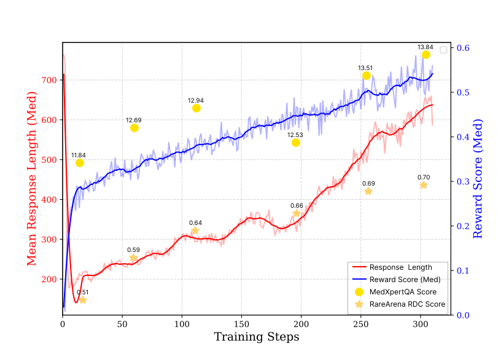
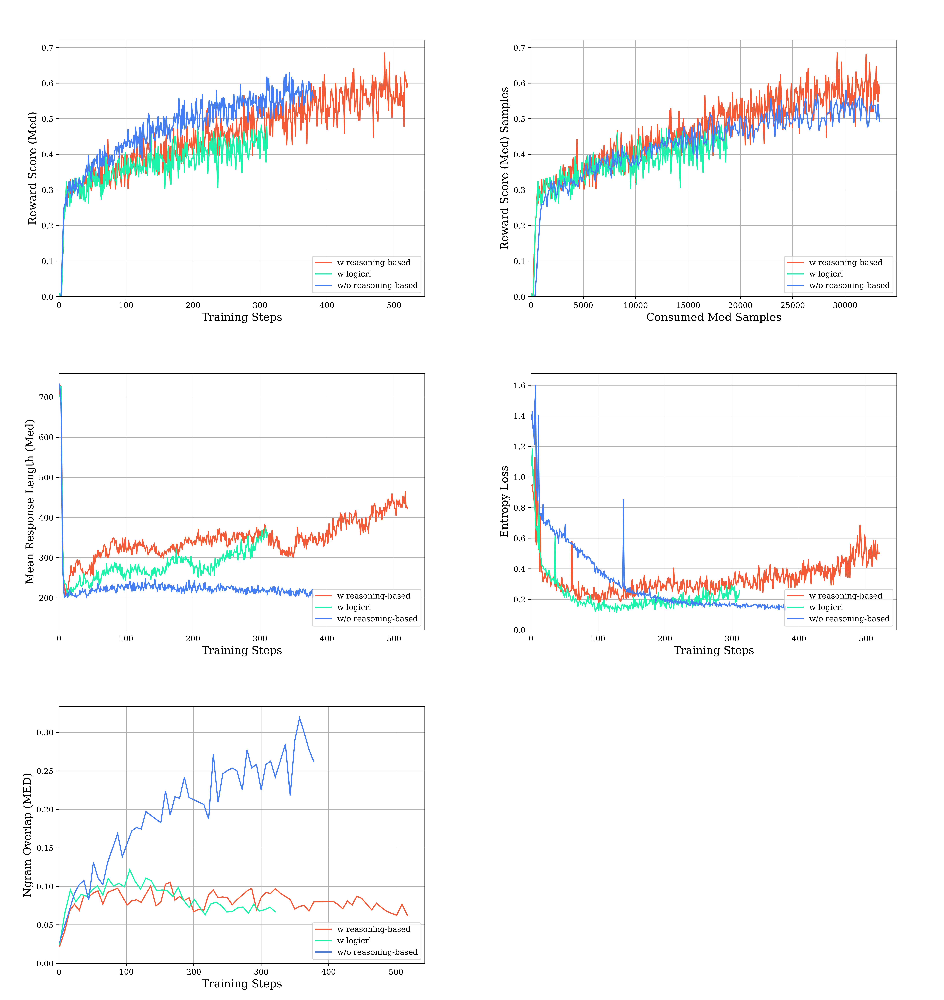
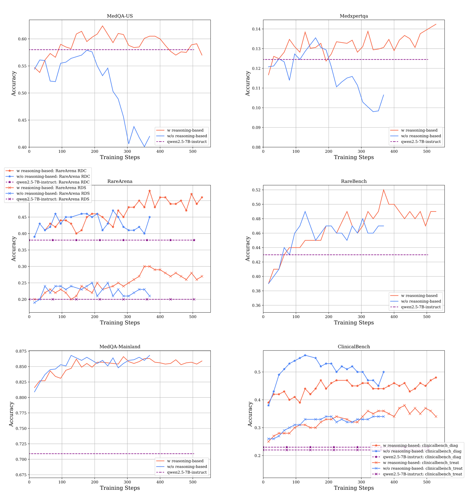
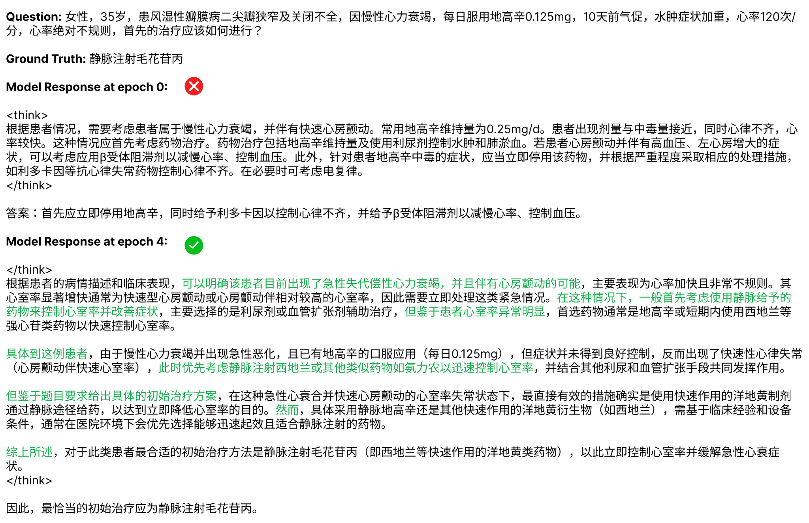

# 📖 ReMEDY: Reasoning-Medical Enhancement Deepened bY Reinforcement Learning

## 🎯 Overview
Inspired by [*Deepseek-R1-Zero*](https://arxiv.org/abs/2501.12948), this study explores the potential of rule-based reinforcement learning (RL) to enhance reasoning capabilities in medical problem-solving.

Our experiments revealed that relying solely on medical question-answering (QA) data resulted in limited token length increases during training. By integrating reasoning-based data, we observed improvements in test-time scaling for medical tasks in response length. Additionally, the model's response pattern shifted from knowledge recall to reasoning-based thinking.

Moreover, testing results indicated that training with both medical and reasoning-based datasets led to significant improvements across both in-domain and out-of-domain medical benchmarks, surpassing the performance achieved with medical data alone. We demonstrate that rule-based reward reinforcement learning holds substantial potential beyond mathematics and coding tasks.

By sharing experimental insights and open-sourcing relevant code and data, we aim to inspire future research on large-scale model reinforcement learning in diverse domains.

<div align="center">

</div>

## 📝 Training Details

### Dataset
* **Medical**: We collected the training dataset from [*MedQA*](https://arxiv.org/abs/2009.13081) and [*MedMCQA*](https://arxiv.org/abs/2203.14371). Multiple-choice questions were reformatted into open-ended formats, excluding those unsuitable for conversion or lacking unique answers (e.g., questions requiring identification of incorrect options). We then employed perplexity (PPL) and pass@n metrics to assess question difficulty. Questions were filtered based on two criteria: 
  1. Those too easily solvable (achieving full correctness within few rollouts).
  2. Overly challenging (consistently scoring ≤2/5 across 16 rollouts, indicating ambiguity or multiple plausible answers).

* **Reasoning**: Randomly sampled from the open-source math dataset available in [*Open-Reasoner-Zero*](https://github.com/Open-Reasoner-Zero/Open-Reasoner-Zero).

* **LogicRL**: Randomly sampled from [*Knights and Knaves (K&K) puzzles dataset*](https://arxiv.org/abs/2410.23123).

The final medical dataset contains 4,146 questions from MedQA (mostly english), 1,486 questions from MedMCQA, 6,348 questions from Open-Reasoner-Zero and 6,348 questions from K&K puzzles dataset.

### Reward Model
Unlike math problems, medical problems often lack a strictly defined ground truth, as models may use synonyms or paraphrases of the correct answer. Consequently, exact equality is not an effective rule-based verification method for medical tasks. To address this, we employ an additional LLM to evaluate and score the answers. This model compares the generated answer with the provided ground truth, assessing whether the answer conveys the same meaning as the ground truth. Answers are scored as 2 for completely correct, 1 for partially correct (i.e., provide multiple answers, with one corresponding to the correct answer), and 0 for incorrect responses.

### Settings
We use [*Qwen2.5-7B*](https://huggingface.co/Qwen/Qwen2.5-7B) as our baseline, using Groupwise Relative Policy Optimization (GRPO), while omitting the KL penalty and applying clip-higher and overlong penalty. The code is built on the [*verl*](https://github.com/volcengine/verl) framework.

It should be noted that, with the same number of training steps, the model with reasoning-based data was trained on only 45% of the medical data compared to the model without reasoning-based data since we maintained the same batch size throughout each steps.

## 🗞️ Our Findings

### ⚡ Test-time scaling when integrating with reasoning-base data
<table>
  <tr>
    <td align="center">
      
    </td>
  </tr>
</table>

We observed that without reasoning-based data, the response length in medical tasks remained short, with no indication of scaling up. Entropy continued to decrease, and n-gram overlap sharply increased, indicating greater similarity among rollouts and resulting in low-efficiency learning.

However, when reasoning-based data were integrated, the response length became longer and showed a clear upward trend, and the reward score consistently improved. Additionally, entropy maintained a slow upward trend, which was conducive to enhancing model performance.

We also noticed that logicRL dataset, i.e. the K&K puzzles, exhibited similar functionality to reasoning-based datasets. It also resulted in a noticeable increase in response length and a gradual upward trend in entropy in medical tasks. However, when comparing under the same consumed medical samples, reasoning-based data enhanced the reward score relative to the baseline, whereas the LogicRL dataset slightly reduced it. This suggestes that the quality and diversity of reasoning-based data also influence the model's ability to generalize across other domains.

### ⚡ Generalized ability
We evaluted the model performance both in-domain(MedQA, MedMCQA) and out-of-domain([*MedXpertQA*](https://arxiv.org/abs/2501.18362), [*RareArena*](https://huggingface.co/datasets/THUMedInfo/RareArena), ClinicalBench).

- Although we train the model using questions in an open-ended format, we evaluate its performance on multi-choice QA datasets such as MedQA, MedMCQA, and MedXpertQA in the standard multi-choice manner, where the model selects the correct option from provided choices.
- RareArena dataset is a comprehensive rare disease diagnostic dataset. In this dataset, the model is required to generate five disease names based on patient conditions, and we evaluate the inclusion of the ground truth in the generated list.
- ClinicalBench is an in-house Chinese benchmark featuring open-ended questions, encompassing both diagnostic and treatment tasks.

<table>
  <tr>
    <td align="center">
      
    </td>
  </tr>
</table>

Despite the reduced medical data volume, the model with reasoning-based data outperformed the model without such data in the aforementioned benchmarks. 

However, we did not observe significant improvements in the Chinese benchmarks (bottom left and bottom right). We hypothesize that this is primarily due to the reasoning-based training data being exclusively in English, which hinders the model's ability to generalize these capabilities to Chinese. This limitation might be mitigated in larger language models.

Additionally, we observed a significant decline in performance on the MedQA-US test set when the model was trained exclusively on medical datasets. This suggests an overfitting issue with the open-ended question format, which hinders the performance of the standard multi-choice manner.

## 📈 Benchmark
We compared our method with several baselines using popular medical benchmarks. We employed Deepseek-v3 as the verifier. The results are as follows:


|                                  | MedQA-Mainland(zh) | MedQA-US | MMLU-med | RareArena RDC | RareArena RDS | RareBench | ddxplus | seer | Clinical Diagnosis(zh) | Clinical Treatment(zh) | MedRBench Diagnosis | MedRBench Treatment | NEJM QA | MedXpertQA |
|----------------------------------|--------------------|----------|----------|---------------|---------------|-----------|---------|------|------------------------|------------------------|---------------------|---------------------|---------|------------|
| Baichuan-M1-14B-Instruct         | 80.5               | 77.7     | 82.76    | 84            | 53            | 64        | 47      | 53   | 76                     | 39                     | 86                  | 66                  | 68.86   | 21.63      |
| Qwen2.5-7b-Instruct              | 69.6               | 56.4     | 74.75    | 50            | 30            | 49        | 51      | 54   | 72                     | 32                     | 78                  | 60                  | 48.43   | 11.43      |
| HuatuoGPT-o1-8B                  | 65.4               | 69.1     | 73.33    | 64            | 43            | 59        | 47      | 45   | 51                     | 22                     | 76                  | 51                  | 54.2    | 15.06      |
| HuatuoGPT-o1-7B                  | 83.6               | 47.6     | 61.55    | 56            | 37            | 58        | 52      | 40   | 70                     | 31                     | 74                  | 53                  | 38.22   | 14.33      |
| Remedy (RL from qwen2.5-7b-base) | 88.7               | 61.8     | 77.08    | 69            | 47            | 65        | 49      | 57   | 69                     | 34                     | 83                  | 57                  | 52.55   | 13.87      |


## 📖 Examples
During training, we observed a shift in the model's response pattern from simple knowledge recall to reasoning-based analysis. This process involves enumerating multiple possibilities, eliminating options based on specific patient conditions, transitioning between ideas, selecting the optimal solution, and self-verification.

### Diagnosis(In domain)

<details open>

<div align="center">

</div>

</details>

### Diagnosis(Out of domain)

<details open>

<div align="center">

</div>

</details>


### Treatment(In domain)

<details open>

<div align="center">

</div>

</details>

## 🚀 Usage

Our implementation primarily builds upon [*verl*](https://github.com/volcengine/verl). Noted that we utilize `vllm==0.7.3`.

Install verl

`cd verl && pip install -e .`

Install my_reward

`cd my_reward && pip install -e .`

The data preprocessing scripts are located in the `data_preprocess` directory. These scripts generate the training data in Parquet format within the `data` directory.

We have developed several reward functions for each dataset, which are available in the `my_reward/my_reward/contrib` directory.

For training, you can review and modify the relevant parameters in `train.sh`. Additionally, you can test your program by executing `test.sh` on a single node with 8 GPUs before running `train.sh` on multiple nodes.

## ✈️ Future Work
* Expanding the scope of medical tasks to include higher quality and diversity.
* Investigating the impact of reasoning-based data quality. In our experiments, the reward score for mathematical tasks quickly reached 0.8 within 100 steps, while the reward score for medical tasks remained at 0.4, we believe that a more challenging reasoning dataset could potentially enhance performance.

## 🤝 Acknowledge

This implementation is mainly based on [*verl*](https://github.com/volcengine/verl). The model serving is based on [*SGLang*](https://docs.sglang.ai/). The base model we utilized in this study is [*Qwen2.5-7B*](https://huggingface.co/Qwen/Qwen2.5-7B). We sincerely appreciate their contributions to the open-source community.

## 📝 Contributors and Citation

Contributors: Youquan Li, Zheng Liang, Keer Lu, Da Pan, Shusen Zhang, Xin Wu, Fan Yang, Weipeng Chen, Guosheng Dong, Zenan Zhou.

```
@misc{ReMEDY,
  title        = {ReMEDY: Reasoning-Medical Enhancement Deepened bY Reinforcement Learning},
  author       = {Youquan Li, Zheng Liang, Keer Lu, Da Pan, Shusen Zhang, Xin Wu, Fan Yang, Weipeng Chen, Guosheng Dong, Zenan Zhou},
  howpublished = {\url{https://github.com/Aaawahe/ReMEDY}},
  year         = {2025}
}
```

